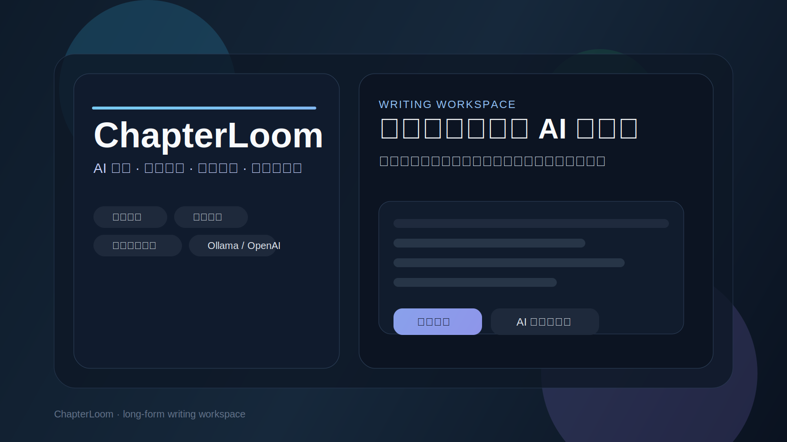

# ChapterLoom



ChapterLoom 是一款面向长篇创作的 AI 写作工具，支持章节管理、自动保存、全文搜索、人物 / 设定卡、章节摘要、历史版本，以及 Ollama 和 OpenAI 兼容模型接入。

它适合小说、网文、剧本、设定文档等需要连续创作的场景。

## 功能

- 章节管理：新建、切换、重命名、删除章节
- 连续写作：上一章 / 下一章快速跳转，下一章可直接新建并切换
- 自动保存：本地自动保存，断网也可继续写作
- 全文搜索：搜索全部章节内容并快速定位
- AI 对话：围绕当前写作内容提问 AI
- 可选上下文：可自由选择参与 AI 生成的章节
- 本地 / 云端模型切换：支持 Ollama 与 OpenAI 兼容接口
- 创作资料库：人物卡、设定卡、章节摘要、历史版本
- 数据导入导出：支持备份与迁移

## 技术栈

- React
- TypeScript
- Vite
- Node.js 本地 AI 代理

## 运行方式

### 1. 安装依赖

```bash
npm install
```

### 2. 启动开发环境

```bash
npm run dev
```

启动后会同时运行前端页面和本地 AI 代理服务。

### 3. 构建生产版本

```bash
npm run build
```

### 4. 预览生产构建

```bash
npm run preview
```

## AI 配置

### 本地 Ollama

1. 安装并启动 Ollama
2. 拉取模型，例如：

```bash
ollama pull qwen3.6:27b
```

3. 打开设置，切换到“本地模型”
4. API 地址通常使用：

```text
http://localhost:11434
```

5. 模型名填写本机可用模型，例如：

```text
qwen3.6:27b
```

本地模型通常不需要 API Key。

### OpenAI 兼容接口

如果你使用云端模型或 OpenAI 兼容服务：

1. 打开设置，切换到“云端模型”
2. 填写接口地址、模型名和 API Key
3. 常见接口示例：

```text
https://api.openai.com/v1/chat/completions
```

## 项目结构

```text
src/
  components/       UI 组件
  ai.ts             AI 上下文拼装
  renderMarkdown.ts Markdown 渲染
  storage.ts        本地存储
  types.ts          类型定义
  utils.ts          工具函数
  useWriterState.ts 状态与业务逻辑
server.mjs          本地 AI 代理
```

## 隐私说明

- 写作内容默认保存在浏览器本地存储中
- API Key 仅保存在本地，不会主动上传到第三方
- 发送给 AI 的上下文由你自己控制

## 未来规划

- 富文本编辑增强
- 更强的版本管理
- 章节大纲与写作目标
- 云同步
- 桌面端打包
- 更细的 AI 记忆系统

## 说明

当前仓库已经具备可用的 MVP 能力，README 会持续跟随功能演进更新。

## 智能体协作

仓库根目录提供了 [AGENTS.md](AGENTS.md) 和 [CLAUDE.md](CLAUDE.md)，用于让 Codex、Claude Code 和其他智能体快速找到：

- 项目入口
- 运行命令
- 代码结构
- 修改约束
- AI 模型接入约定

如果你是通过智能体接手这个仓库，优先阅读这两个文件，再进入 [src/App.tsx](src/App.tsx)、[src/useWriterState.ts](src/useWriterState.ts) 和 [src/storage.ts](src/storage.ts)。

## 参与贡献

欢迎提交 Issue 和 Pull Request。

- 功能建议请优先用 Issue 描述使用场景和预期结果
- Bug 反馈请尽量附上复现步骤和截图
- 提交代码前建议先运行 `npm run build`

仓库已经提供了 GitHub 贡献模板，方便直接发起问题和提交变更。
